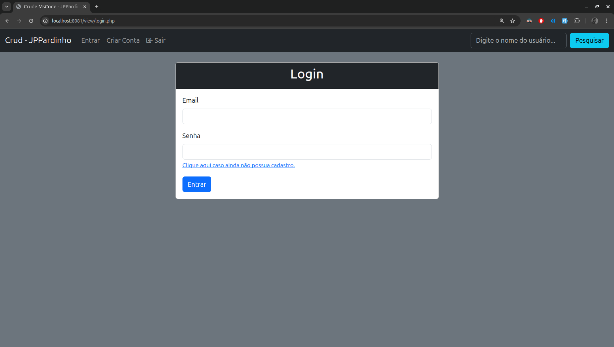
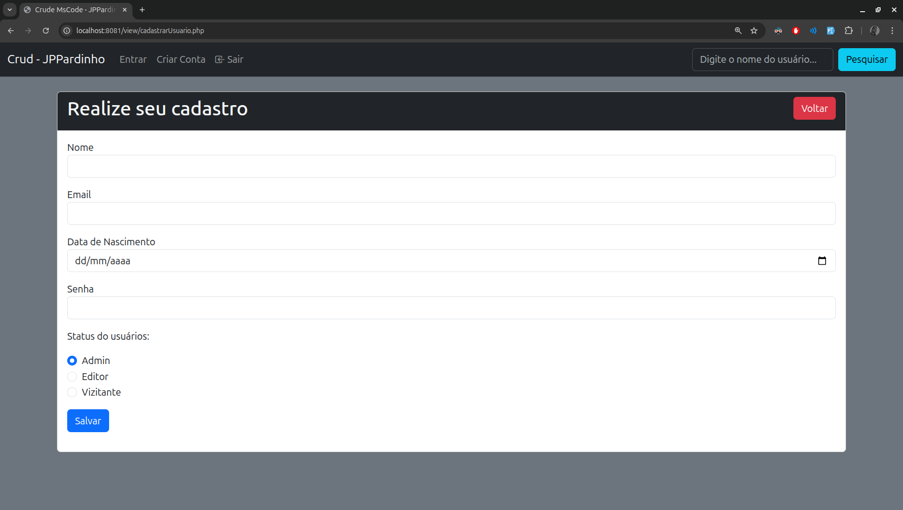
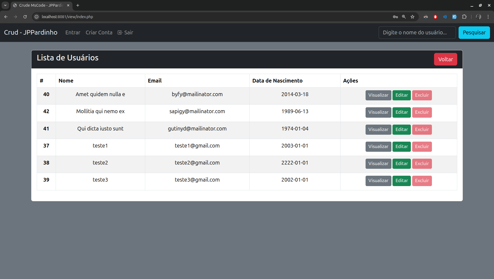

# CRUD de Usuários em PHP Puro com PDO

Um projeto acadêmico de um sistema de CRUD (Create, Read, Update, Delete) para gerenciamento de usuários, desenvolvido com PHP puro, utilizando a extensão PDO para conexão segura com o banco de dados MySQL.

Este projeto foi desenvolvido como parte dos estudos no curso **MScode**, sob orientação do professor **Rejman**.

---

### Funcionalidades

-   [x] **Cadastro de Usuários:** Permite a criação de novos usuários com nome, e-mail, data de nascimento e senha.
-   [x] **Sistema de Login:** Autenticação de usuários com verificação de senha segura e uso de sessões.
-   [x] **Listagem de Usuários:** Exibe todos os usuários cadastrados em uma tabela.
-   [x] **Edição de Dados:** Permite que os dados de um usuário existente sejam atualizados.
-   [x] **Exclusão de Usuários:** Remove o registro de um usuário do banco de dados.
-   [x] **Níveis de Permissão:** Sistema simples de status (Admin, Editor, Visitante) para controlar ações na interface.

---

### Telas do Sistema

Aqui estão algumas telas que demonstram o visual e as funcionalidades da aplicação.

**Tela de Login**


**Tela de Cadastro de Usuário**


**Tela Principal (Listagem de Usuários)**


---

### 🛠️ Tecnologias Utilizadas

-   **Backend:** PHP 8+
-   **Banco de Dados:** MySQL
-   **Conexão DB:** PDO (PHP Data Objects)
-   **Frontend:** HTML5, CSS3, Bootstrap 5

---

### Como Executar o Projeto

Siga os passos abaixo para rodar o projeto em seu ambiente local.

**Pré-requisitos:**
* Um servidor local (XAMPP, WAMP, Laragon, etc.)
* PHP 8 ou superior
* MySQL ou MariaDB

**Passos:**

1.  **Clone o repositório:**
    ```bash
    git clone git@github.com:JP-Pardinho/crud-usuarios.git
    ```

2.  **Crie o banco de dados:**
    -   Crie um banco de dados no seu MySQL com o nome `crud_usuarios`.
    -   Importe o arquivo `database.sql` para criar a tabela `usuarios`.

3.  **Configure a conexão:**
    -   Abra o arquivo `database/Database.php`.
    -   Altere as variáveis `$host`, `$db_name`, `$username` e `$password` de acordo com a configuração do seu ambiente local.

4.  **Inicie o servidor:**
    -   Inicie os serviços Apache e MySQL do seu servidor local.

5.  **Acesse no navegador:**
    -   Abra seu navegador e acesse `http://localhost/nome-da-pasta-do-projeto/view/login.php`.
